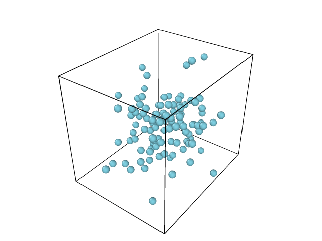
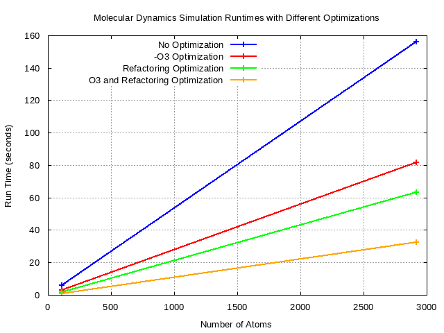
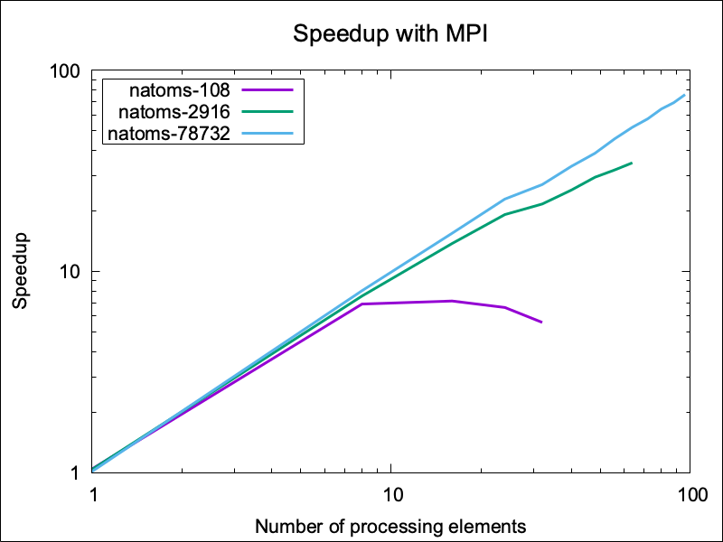

# GROUP 3
- Edward  -  ed-ntim
- Jenny   -  jalmerol-mhpc
- Natalia -  VanuatuN 

## PROJECT:  LJ MD Model for Liquid Argon

## Overview

This repository provides a molecular dynamics (MD) model using the Lennard-Jones potential 
for simulating the behavior of liquid argon. The Lennard-Jones potential is a mathematical 
model commonly employed in molecular dynamics (MD) simulations to describe intermolecular interactions.

## Lennard-Jones Potential Equation

The Lennard-Jones potential is expressed by the following equation:

$\[ V(r) = 4 \epsilon \left[ \left(\frac{\sigma}{r}\right)^{12} - \left(\frac{\sigma}{r}\right)^6 \right] \]$


Where:
- $\( V(r) \)$ is the potential energy between two particles as a function of their separation distance $\( r \)$.
- $\( \epsilon \)$ is the depth of the potential well, representing the strength of the attractive forces between particles.
- $\( \sigma \)$ is the finite distance at which the inter-particle potential is zero, representing the distance at which 
the repulsive forces dominate.

The first term $\( \left(\frac{\sigma}{r}\right)^{12} \)$ represents the attractive forces, 
and the second term $\( \left(\frac{\sigma}{r}\right)^6 \)$ represents the repulsive forces.

## Usage

To utilize this model for liquid argon simulations, follow the instructions in the provided codebase. 
Make sure to adjust the values of $\( \epsilon \)$ and $\( \sigma \)$ based on experimental data or 
quantum mechanical calculations to better represent the specific properties of argon.


## Simulation/Programming steps
1. Read in parameters and initial status and compute what is missing (e.g. accelerations) <br>
2. Integrate Equations of motion with Velocity Verlet for a given number of steps <br>
a) Propagate all velocities for half a step <br>
b) Propagate all positions for a full step <br>
c) Compute forces on all atoms to get accelerations <br>
d) Propagate all velocities for half a step <br>
e) Output intermediate results, if needed <br> 

## Expected output:
\
Figure 1: Animation of the simulation of Argon (108 atoms) in a cubic box for 10000 MD steps

## Goals:

## I. Group Level

- break down the single file ljmd.c into multiple files (force compute, verlet time integration (split
into two functions in one file), input, output, utilities, cleanup, main function, and header for data
structures and prototypes); update the CMakeLists.txt file accordingly so that you build one
executable from main.cpp and a library, mdlib.
- set up some simple unit tests with the googletest library (write C++ code that allocates/fills
data structure(s), calls the respective functions and uses assertions to check if the result is as
expected) and integrate those tests into the CMake procedure so the tests can be run with ctest.
For example:
a) compute forces for a few 2-3 particle systems with atoms inside/outside the cutoff (directly
and with images via PBC)
b) compute part of the time integration for given positions, forces and velocities (no call to
force())
c) compute kinetic energy for given velocities and mass
d) create a minimal input file (containing a few atoms) and matching restart on the fly and verify
that that data is read correctly

## II. Individual Level

## How to build (Serial code):

To compile the default serial code with No optimizations, use the following commands:
```C
cmake -S . - B build
cmake --build build
cd build
ctest
```
To compile with -O3 optimization, uncomment "# add_definitions(-O3)" in the 
"#Add Definitions" section of the CMakeLists.txt file, and repeat the compilation steps.

To compile with Refactoring, uncomment "# add_definitions(-DREFACTOR)"
in the "#Add Definitions" section of the CMakeLists.txt file, and repeat the compilation steps.

To compile with both -O3 and  Refactoring optimizations, uncomment both 
and repeat the compilation steps. 

## How to Build (With MPI parallelism):

## How to Build (With OpenMP parallelism):

## How to Run (Serial code):
```C
cd examples/
../build/./md < argon_108.inp > output.dat
more output.dat       
```
## How to Run (With MPI parallelism):

## How to Run (With OpenMP parallelism):

## Benchmark Report (a):

<br>
Figure 2: Scaling plot of the MD Runtimes(s) vs. Number of Atoms using different optimisation schemes 

## Benchmark Report (b):

<br>
Figure 2: Speedup using MPI for different number of atoms.
## Benchmark Report (c):

## Acknowledgments

This model is based on the widely accepted Lennard-Jones potential and may require further customization for specific applications. Please refer to relevant literature and consult experts in the field for a more accurate representation of liquid argon properties in your simulations.