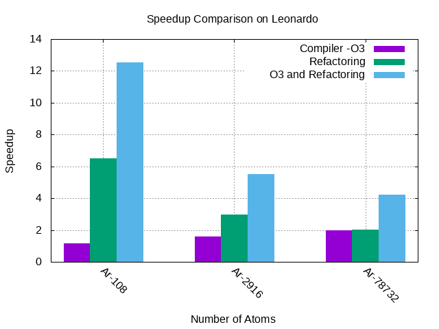

## GROUP 3
- Edward  -  ed-ntim
- Jenny   -  jalmerol-mhpc
- Natalia -  VanuatuN 

### PROJECT:  Lennard-Jones (LJ) MD Model for Simulating Liquid Argon

### Overview

This repository provides a molecular dynamics (MD) model using the Lennard-Jones potential 
for simulating the behavior of liquid argon. The Lennard-Jones potential is a mathematical 
model commonly used in molecular dynamics (MD) simulations to describe intermolecular interactions.

### Lennard-Jones Potential Equation

The Lennard-Jones potential is expressed by the following equation:

$\[ V(r) = 4 \epsilon \left[ \left(\frac{\sigma}{r}\right)^{12} - \left(\frac{\sigma}{r}\right)^6 \right] \]$


Where:
- $\( V(r) \)$ is the potential energy between two particles as a function of their separation distance $\( r \)$.
- $\( \epsilon \)$ is the depth of the potential well, representing the strength of the attractive forces between particles.
- $\( \sigma \)$ is the finite distance at which the inter-particle potential is zero, representing the distance at which 
the repulsive forces dominate.

The first term $\( \left(\frac{\sigma}{r}\right)^{12} \)$ represents the attractive forces, 
and the second term $\( \left(\frac{\sigma}{r}\right)^6 \)$ represents the repulsive forces.

### Usage

To use this model for liquid argon simulations, follow the instructions in the provided codebase. 
The values of $\( \epsilon \)$ and $\( \sigma \)$ can be adjusted based on experimental data or quantum mechanical calculations to better represent the specific properties of argon.


### Simulation/Programming steps
1. Read in parameters and initial status and compute what is missing (e.g. accelerations) <br>
2. Integrate Equations of motion with Velocity Verlet for a given number of steps <br>
a) Propagate all velocities for half a step <br>
b) Propagate all positions for a full step <br>
c) Compute forces on all atoms to get accelerations <br>
d) Propagate all velocities for half a step <br>
e) Output intermediate results, if needed <br> 


### Goals:

**I. Group Level**\
To :
- break down the single file ljmd.c into multiple files (force compute, verlet time integration (split into two functions in one file), input, output, utilities, cleanup, main function, and header for data structures and prototypes); update the CMakeLists.txt file accordingly in order to build one executable from main.c and a library, mdlib.
- set up some simple unit tests with the googletest library (write C++ code that allocates/fills data structure(s), calls the respective functions and uses assertions to check if the result is as expected) and integrate the aforementioned tests into the CMake procedure so the tests can be run with ctest.\
For example:\
a) compute forces for a few 2-3 particle systems with atoms inside/outside the cutoff (directly and with images via PBC)\
b) compute part of the time integration for given positions, forces and velocities (no call to force())\
c) compute kinetic energy for given velocities and mass\
d) create a minimal input file (containing a few atoms) and matching restart on the fly and verify that that data is read correctly

**II. Individual Level**\
a) Edward: Optimize the force computation: *refactor the code* for better optimization and to avoid costly operations or redundant work. Adapt data structures as needed. *Document improvements with profiling/benchmark data.*<br> 
b) Jenny: Add *MPI parallelization*. Document the *parallel efficiency* of changes.<br>
c) Natalia: Add *OpenMP parallelization*. Document the *parallel efficiency* of changes. 

### How to build (Serial code):

To compile the default serial code with No optimizations, use the following commands:
```C
cmake -S . -B build
cmake --build build
cd build
ctest
```
- To compile with -O3 optimization, uncomment "# add_definitions(-O3)" in the 
"#Add Definitions" section of the CMakeLists.txt file, and repeat the compilation steps.

- To compile with Refactoring, uncomment "# add_definitions(-DREFACTOR)"
in the "#Add Definitions" section of the CMakeLists.txt file, and repeat the compilation steps.

- To compile with both -O3 and  Refactoring optimizations, uncomment both 
and repeat the compilation steps. 


### How to Run (Serial code):
```C
cd examples/
../build/./md < argon_108.inp > output.dat
more output.dat       
```

### Benchmark Report (a):

<br>

**Figure 2:** Plot of the MD Runtimes(s) vs. Number of Atoms using different optimisation configuration on a MacBook, showing a general decrease in runtime with optimization.



**Figure 3:** Plot of speedup of serial code with different optimization configurations (purple : -O3 compiler flag, green: Refactoring of force computation kernel, blue: combination of -O3 and refactoring) vs. Number of atoms (system size).
### Performance Analysis

**Table 1:** Summary of performance counter statistics for the LJMD code compiled with different optimization options for simulation of 108 Ar-atoms **(Best case)**


| Metric                             | No Optimization | -O3 Optimization | Refactoring | -O3 Optimization + Refactoring |
|------------------------------------|-----------------|-------------------|-------------|--------------------------------|
| Cache References (K/sec)            | 1.579           | 22.723            | 74.305      | 155.732                        |
| Cache Misses (%)                    | 26.417          | 54.472            | 80.042      | 22.354                         |
| Instructions per Cycle             | 1.70            | 1.69              | 1.70        | 1.38                           |
| Branches (M/sec)                    | 869.835         | 939.936           | 617.361     | 897.081                        |
| Branch Misses (%)                   | 1.65            | 1.79              | 4.58        | 5.84                           |
| CPU Cycles (GHz)                    | 3.390           | 3.400             | 3.399       | 3.399                          |
| User Time (seconds)                 | 15.061          | 12.729            | 2.321       | 1.204                         |
| System Time (seconds)               | 0.004           | 0.005             | 0.002       | 0.004                          |
| Elapsed Time (seconds)              | 15.090          | 12.753            | 2.331       | 1.217                         |


**Cache Metrics (References and Misses):**

Cache references and misses help to understand memory access efficiency. Comparison of cache metrics across different configurations show how well the code utilizes the cache hierarchy.\
Cache references increase significantly with optimization, suggesting better cache utilization. The combination of "-O3" Optimization and Refactoring stands out with both high references and low misses, indicating improved memory access patterns.

**Instructions per Cycle:**

Instructions per cycle shows efficiency of the code's execution. Lower values typically indicate better instruction-level parallelism and more efficient execution. The instruction per cycle metric remains relatively stable across the different configurations. This suggests that, while configuration type affected other aspects of performance, the efficiency of instruction execution is consistent.

**Branch Metrics (Branches and Branch Misses):**

Branches and branch misses relate to control flow efficiency (for loops, if conditions, etc). The number of branches executed per second increased with optimization, indicating potential changes in the control flow. However, the increase in branch misses in some configurations suggests that, while optimizations may improve overall execution speed, they could possibly complicate branch prediction scenarios.

**CPU Cycles:**

CPU cycles represent the total computational work done by the CPU. This metric is influenced by the efficiency of instruction execution and memory access patterns.\
CPU cycles per second remain relatively consistent across all configurations, indicating that the optimizations do not significantly impact the overall computational workload.

**User Time, System Time, and Elapsed Time:**

User time reflects the time spent executing the code, while system time accounts for time spent in the cluster's OS kernel. Elapsed time is the overall time taken for code execution.
User time decreases significantly with optimization, indicating improved overall runtime efficiency. The combination of -O3 optimization and refactoring provides the lowest user and system times, suggesting a balanced approach to optimization.

**Worst Case Performance :**

The worst-case scenario (Ar-78732 atoms) confirmed the scalability of the LJMD code under different optimization configurations, with the larger dataset affecting certain metrics but maintaining similar trends observed in the smaller dataset (refer to perf_summary_78732.dat for details).
The combination of -O3 optimization and refactoring continued to stand out as providing a balanced improvement in user and system times while maintaining reasonable cache misses and branch mispredictions, irrespective of the dataset size.

**Summary :**

In summary, there were trade-offs and benefits of different optimization configurations.
The permutation of metrics revealed that while some optimizations possibly improved certain hardware-level aspects (e.g., cache efficiency), they could introduce challenges in others (e.g., increased branch misses). The combination of -O3 optimization and refactoring appears to strike a balance, resulting in the most favorable overall performance.
In conclusion, the performance counters provided  a recognition and appreciation of the complexity, intricacies, and subtleties involved when adopting a configuration for optimization, rather than a simplistic or one-dimensional view of how different aspects of code optimization impact efficiency. It highlights the need for a holistic approach, considering the interplay of various metrics to achieve optimal results.


### Acknowledgments

- This model is based on the widely accepted Lennard-Jones potential and may require further customization for specific applications.

### References
- P1.7 Part-3 Lecture Slides, MHPC-2023, by Dr. Axel Kohlmeyer