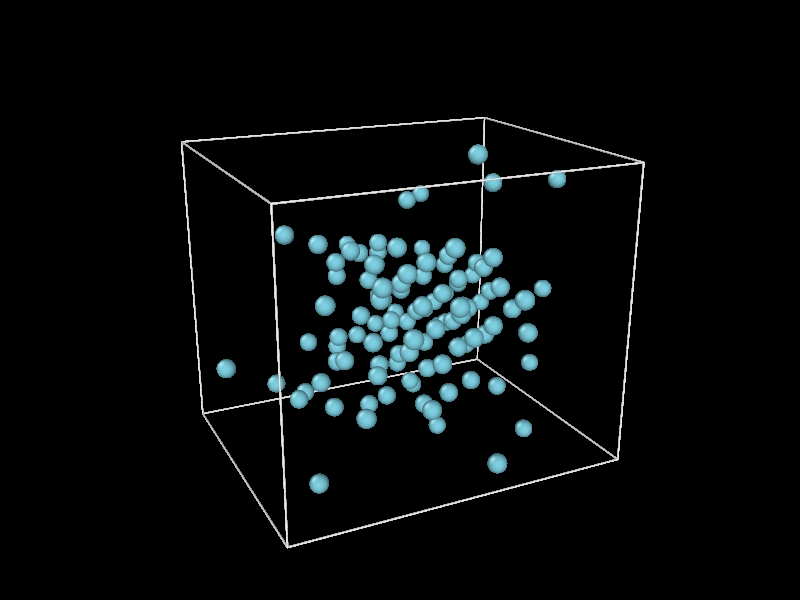

# Morse Potential

The Morse Potential constitutes an interatomic interaction model describing the potential energy of a diatomic molecule. Mathematically, it is expressed as follows:

$U_{M} = D_M [1 - \exp(-\alpha(r - R))]^{2}$ .

In this equation, $D_M$ represents the pair potential well depth, $\alpha$ is an adjustable parameter determining the range of interparticle forces, and $R$ denotes the equilibrium separation between atoms.

Near equilibrium ($r \approx R$),  $D_M = \varepsilon$ of the Lennard-Jones potential. The relationship for $\alpha$ and $R$ is constant, that is, $\alpha R = 6$. Here, we use $R = 2^{1/6} \sigma$.

The first derivative of the Morse potential is

$F(r) = 2\alpha D_M \exp(-\alpha(r - R)) [\exp(-\alpha(r - R) -1 ])$ .

The Morse Potenatial is implemented as follows

```C
double exponent = 1.0 /6.0;
double R = pow(2.0, exponent) * sys->sigma;
double alpha = 6.0 / R;
double coeffs = 2.0 * sys->epsilon * alpha;
```
for the constant variables.

The potential and force are implemented as follows

```C
double expoterm = exp(-alpha * (r - R));
ffac = coeffs * expoterm * (expoterm - 1.0)

epot += sys->epsilon * (1.0 - expoterm) * (1.0 - expoterm);
```

To compile using Morse potential, use the following commands:
```C
cmake -S . -B build -DUSE_MORSE=ON
cmake --build build
```

<br>

Figure 1. Visualization of the trajectory of 108 Ar atoms using Morse potential.